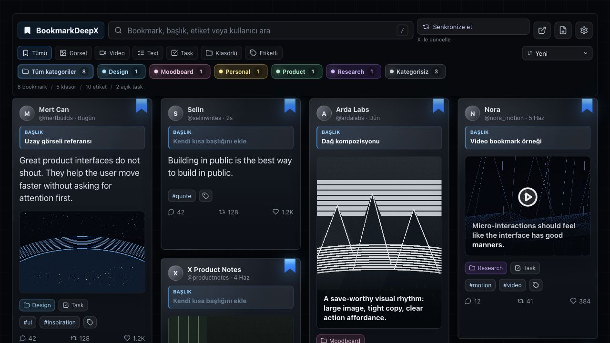
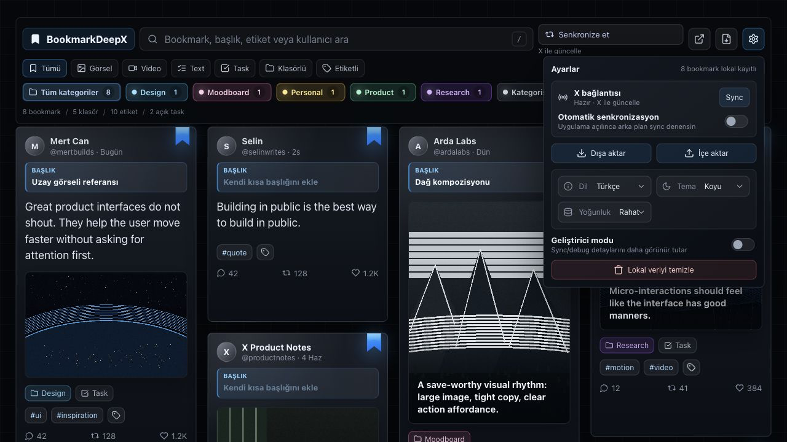
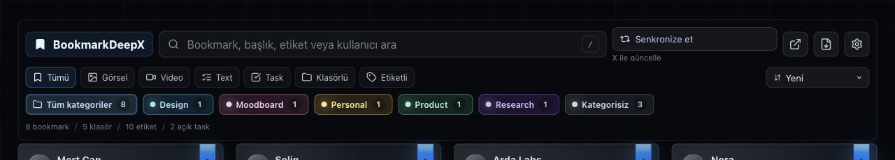

# BookmarkDeepX



[](https://github.com/KeremDev/BookmarkDeepX/releases/tag/v1.0.0)
[](LICENSE)
[](https://github.com/KeremDev/BookmarkDeepX/releases/latest)

BookmarkDeepX is a local-first workspace for managing X bookmarks without official X API access, developer keys, or a backend server. Search, title, tag, folder, task, sync, export, import, and remove bookmarks from X from a fast masonry board.

## Quick Install

No terminal or `npm` commands are required for regular use.

1. Download `BookmarkDeepX-v1.0.0.zip` from [GitHub Releases](https://github.com/KeremDev/BookmarkDeepX/releases/latest).
2. Unzip the file.
3. Open `chrome://extensions`.
4. Enable **Developer Mode**.
5. Click **Load unpacked**.
6. Select the unzipped BookmarkDeepX folder. Do not select `manifest.json` directly; Chrome needs the folder that contains it.
7. Open BookmarkDeepX from the extension icon.

## Screenshots

| Board | Settings + Language |
| --- | --- |
|  |  |

| Card Actions | Sync Status |
| --- | --- |
|  |  |

## Features

- Sync bookmarks from the user's logged-in X web session.
- Search by bookmark text, title, tag, folder, author, or handle.
- Filter by media type, text, tasks, folders, and tags.
- Add local titles, tags, folders, and tasks.
- Remove a bookmark from BookmarkDeepX and sync the removal to X when the user's X session is available.
- Open the original X bookmark or author profile.
- Export and import local BookmarkDeepX data.
- Switch language between Turkish and English.
- Choose theme and density from Settings.

## How It Works

BookmarkDeepX does not use official X API credentials. It works through the user's logged-in X web session:

- A content script runs on `x.com` and `twitter.com`.
- A small page bridge observes relevant X web requests.
- Bookmark responses are parsed into a local model.
- Local metadata such as title, tags, folder, and task is stored in Chrome local storage.
- Removing a bookmark uses the user's X session and then updates local storage.

## Privacy

- No backend server.
- No telemetry.
- No external analytics.
- No official X API token or developer app.
- Bookmark metadata stays on the user's device in Chrome local storage.

## Development

This section is only for developers and contributors. Regular users do not need these commands.

<details>
<summary>Developer setup and commands</summary>

| Command | What it does |
| --- | --- |
| `npm ci` | Installs the exact project dependencies from `package-lock.json`. |
| `npm run dev` | Starts the local Vite dashboard preview for UI work. This is not the full Chrome extension runtime. |
| `npm test` | Runs parser tests for captured X bookmark responses. |
| `npm run build` | Builds the Chrome extension files into the `dist` folder. |
| `npm run package:extension` | Builds the extension and creates the installable ZIP file. |

Install project dependencies:

```bash
npm ci
```

Run the local dashboard preview:

```bash
npm run dev
```

This is useful for interface work, but it does not run Chrome extension APIs, content scripts, or background service worker behavior.

Run tests and build:

```bash
npm test
npm run build
```

Test the extension locally:

1. Run `npm run build`.
2. Open `chrome://extensions`.
3. Enable **Developer Mode**.
4. Click **Load unpacked**.
5. Select the generated `dist` folder. This folder contains the extension `manifest.json`.

Create the installable extension ZIP:

```bash
npm run package:extension
```

The ZIP is written to `release/BookmarkDeepX-v1.0.0.zip`.

</details>

## FAQ

### Does X need to be open?

For the first sync, open X and visit the bookmarks page once. BookmarkDeepX can then reuse captured request templates for background sync when possible.

### Why are some author names missing?

X changes its internal response shape often. BookmarkDeepX parses several response shapes and also patches visible author data from the DOM, but a few edge cases may need parser updates.

### Why can sync take time?

X bookmark timelines are paginated. BookmarkDeepX captures pages progressively and avoids forcing visible scrolling when a reusable network template is available.

### Where is my data stored?

In Chrome local storage on your device. Use Export/Import from Settings to back it up or move it.

## Türkçe

BookmarkDeepX, X bookmark'larını resmi X API erişimi, developer token veya backend sunucu olmadan yönetmek için local-first bir Chrome eklentisidir. Arama, başlık ekleme, etiketleme, klasörleme, task oluşturma, X ile senkron kaldırma, dışa/içe aktarma ve Türkçe/İngilizce dil desteği sunar.

### Hızlı Kurulum

Normal kullanım için terminal veya `npm` komutu çalıştırman gerekmez.

1. [GitHub Releases](https://github.com/KeremDev/BookmarkDeepX/releases/latest) sayfasından `BookmarkDeepX-v1.0.0.zip` dosyasını indir.
2. ZIP dosyasını aç.
3. `chrome://extensions` sayfasına git.
4. **Developer Mode** seçeneğini aç.
5. **Load unpacked** butonuna bas.
6. ZIP'ten çıkan BookmarkDeepX klasörünü seç. `manifest.json` dosyasını tek başına seçme; Chrome bu dosyanın bulunduğu klasörü ister.
7. BookmarkDeepX'i eklenti ikonundan aç.

### Güvenlik ve Gizlilik

- Resmi X API token'ı veya developer app gerekmez.
- Backend veya dış sunucu yoktur.
- Telemetry veya analytics yoktur.
- Bookmark verileri cihazındaki Chrome local storage içinde tutulur.

### İletişim

- Hata bildirimi: [GitHub Issues](https://github.com/KeremDev/BookmarkDeepX/issues)
- Özellik önerileri: [GitHub Discussions](https://github.com/KeremDev/BookmarkDeepX/discussions)
- Güvenlik: [SECURITY.md](SECURITY.md)

## Roadmap

- Chrome Web Store distribution.
- More parser fixtures for X response changes.
- Better bulk actions.
- Optional advanced debugging tools for contributors.

## License

MIT. See [LICENSE](LICENSE).
